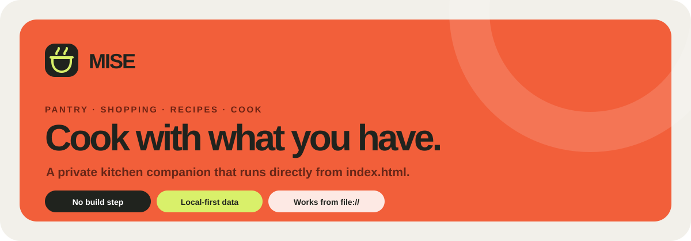
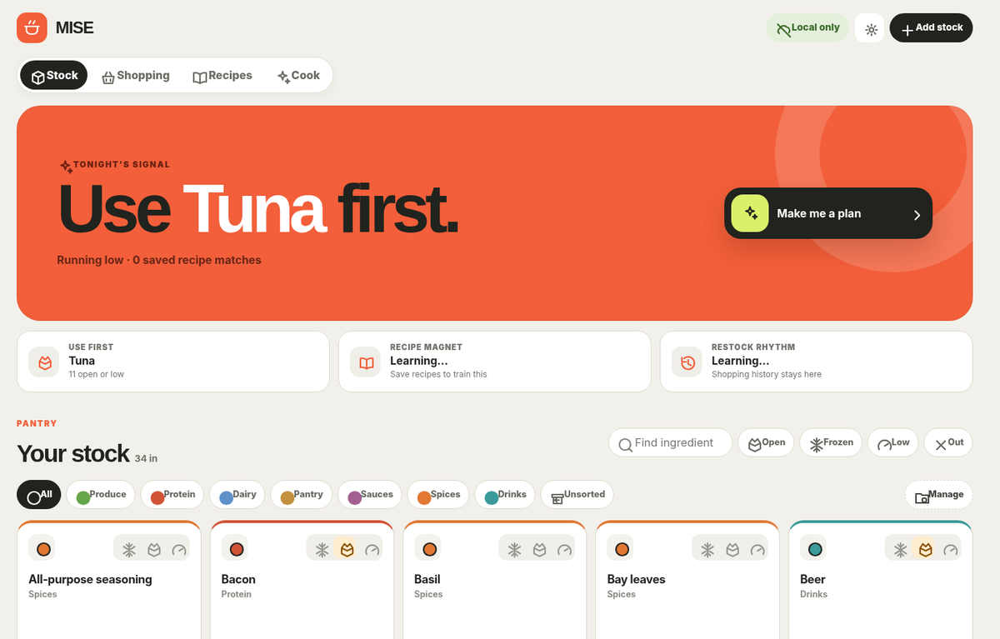

<p align="center">
  
</p>

# Mise

**Mise is a local-first kitchen companion for keeping track of what you have, what you need, and what you can cook next.**

It brings pantry tracking, shopping, saved recipes, and an AI-ready cooking brief into one small static web app. There is no account, database, backend, npm install, or build step required to deploy it. The repository can be published directly to GitHub Pages and installed as a PWA.

## The idea

Most recipe apps start with a dish and tell you what to buy. Mise starts with **your actual kitchen**.

Track what is in stock, mark ingredients as open, frozen, low, or out, and let Mise surface useful local signals such as what to use first, common restocks, and ingredients that repeatedly appear in recipes you save. When you want ideas, Mise turns the current state of your kitchen into a structured prompt you can copy into the AI assistant of your choice.

The cooking brief includes quick meals, more involved options, freezer-friendly batch cooking, a wild card, and — when the stock makes sense — a **prep-ahead idea** you can start today and finish tomorrow or later, such as a long marinade, overnight soak/proof, pickle, ferment, or other slow preparation.

<p align="center">
  
</p>

## What it does

- **Stock** — Track ingredients, quantities, categories, and states such as open, frozen, low, and out.
- **Shopping** — Build a list manually, import a `[SHOPPING]` block, or use locally ranked restock suggestions.
- **Recipes** — Save recipe text and compare its ingredients with what is currently in stock.
- **Cook** — Generate a detailed cooking brief from live stock, saved-recipe habits, and your preferred cooking tone.
- **Prep ahead** — Let the cooking brief suggest something worth starting now for tomorrow or later when a long rest genuinely improves it.
- **Local signals** — Learn simple patterns from shopping and stock activity without sending kitchen data to an application backend.
- **Backup & restore** — Export Mise data as JSON and restore it later from Settings.
- **Installable PWA** — After a successful hosted visit, the app shell and Lucide icon library are cached for later use.

## Run it

### Recommended: GitHub Pages / HTTPS

Mise is designed to be deployed as a static PWA. Push the repository to GitHub, enable **Pages → GitHub Actions**, and the included workflow publishes the files directly — there is no build job.

The first hosted visit needs a connection so the browser can fetch the app and the pinned Lucide icon library. The service worker then caches the application shell and icon library so subsequent launches can work from cache when the network is unavailable.

### Open `index.html` directly

You can still double-click `index.html` and use the app as a normal static page. In that mode:

- no Vite, npm, pnpm, Live Server, or localhost is required;
- Lucide icons require a connection unless the browser already has them cached independently;
- PWA installation/service-worker caching does **not** run from `file://`, because service workers require HTTPS or localhost.

For the intended experience, use the GitHub Pages deployment.

## Privacy and data

Mise stores pantry data, recipes, shopping history, categories, and local usage signals in browser storage. It does not send those records to an application backend.

The **Cook** screen builds its prompt locally. Mise itself does not call an AI API; copying the prompt into another service is an explicit user action.

Hosted mode does make ordinary static-asset requests for the site itself and for the pinned Lucide icon library. Those requests do not contain your pantry, recipes, or shopping history.

Use **Settings → Download backup** before clearing browser data or moving to another device/browser.

## Repository structure

```text
.
├── index.html
├── manifest.webmanifest
├── sw.js
├── assets/
│   ├── icons/
│   │   ├── favicon.svg
│   │   ├── icon-180.png
│   │   ├── icon-192.png
│   │   └── icon-512.png
│   └── readme/
│       ├── hero.svg
│       └── stock-overview.png
├── src/
│   ├── css/
│   │   └── styles.css
│   └── js/
│       ├── runtime.js
│       ├── icons.js
│       ├── data.js
│       ├── logic.js
│       ├── app.js
│       └── pwa.js
└── .github/
    └── workflows/
        └── deploy-pages.yml
```

## How it is built

Mise deliberately stays build-free:

- `runtime.js` provides the tiny renderer and hooks layer.
- `icons.js` adapts **Lucide** icons to that renderer.
- `data.js` contains starter categories and demo pantry data.
- `logic.js` contains storage, matching, recommendations, recipe parsing, and cooking-prompt generation.
- `app.js` contains the UI and interactions.
- `pwa.js`, `manifest.webmanifest`, and `sw.js` provide PWA registration, installation metadata, and caching.
- `styles.css` contains the responsive visual system.

The scripts are loaded as classic browser scripts in dependency order, so there is no bundler or compilation step.

## GitHub Pages

The included workflow publishes the repository directly whenever `main` is updated.

1. Push the project to GitHub.
2. Open **Settings → Pages**.
3. Choose **GitHub Actions** as the source.
4. Push to `main` or run the workflow manually.
5. Open the HTTPS Pages URL once while online, then install Mise from the browser if desired.

## Editing the project

- Change visual styling in `src/css/styles.css`.
- Change starter data in `src/js/data.js`.
- Change matching, recommendations, or cooking-prompt behaviour in `src/js/logic.js`.
- Change interface structure in `src/js/app.js`.
- Change icon names/adaptation in `src/js/icons.js`.
- Change offline/PWA behaviour in `sw.js`, `manifest.webmanifest`, and `src/js/pwa.js`.

The Lucide version is pinned in both `index.html` and `sw.js`; update both together.

## Design goals

Mise aims to stay **small, understandable, local-first, installable, and useful in the real flow of deciding what to cook**. It should feel like a practical kitchen dashboard rather than a recipe catalogue: use what you have, notice what needs attention, plan tonight, and sometimes start tomorrow's food today.
